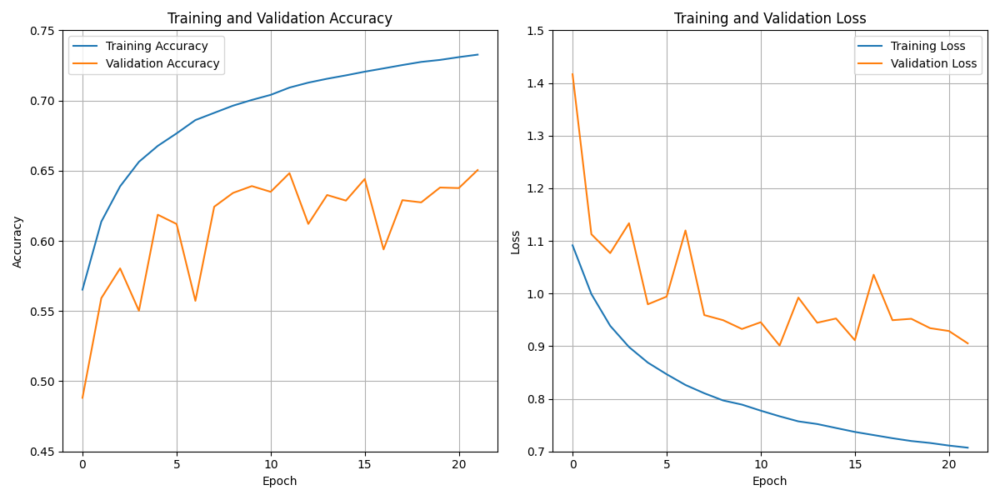

NTHU eegnet Auditory-eeg-challenge-2024
=======================================
### Group: 7
### Team Leader: 林立上
### Members: 蔡承翰 林榮翼 黃諺霖 林諺瓏
### Mentor: 林家合

This repository documents the methodologies and implementation strategies utilized by Team eggnet from National Tsing Hua University to address Task 1 of the Auditory EEG Challenge at ICASSP 2024. The main goal of this task was to precisely identify the correct auditory stimulus corresponding to a given EEG segment from a set of five candidates.

<div align="center">
    <a href="./">
        
    </a>
  <p>Schematic overview of the task</p>
</div>
<br></br>
Our approach leverages Long Short-Term Memory (LSTM) networks within the model, leading to Team eggnet securing the 46th position out of 105 teams in the competition. 

# Performance

We've tried multiple methodologies to enhance the performance of our model. The graphical representation below encapsulates our journey, presenting both the accuracy and loss metrics:
<div align="center">
    <a href="./">
        
    </a>
  <p>Training and validation accuracy/loss plots</p>
</div>
<br></br>
Here is our ultimate score in the challenge, captured in the image below, extracted directly from the leaderboard snapshot:
<div align="center">
    <a href="./">
        
    </a>
    <p>Final score of our submission</p>
</div>
<br></br>
<br></br>

We secured the **46th** position out of **105** submissions. Below, you'll find a comparative analysis of scores, encompassing the baseline, Team MLG (the counterpart focusing on the same topic), and our performance.

<div align="center">
  
| Team | Submission Number | Subjects Mean | Subjects Std | Final Score | Ranking |
| :-: | :-: | :-: | :-: | :-: | :-: |
| **eegnet** | **2** | **53.11** | **12.81** | **53.11** | **46** |
| MLG | 2 | 52.18 | 13.02 | 52.18 | 59 |
| MLG | 1 | 51.59 | 13.86 | 51.59 | 65 |
| eegnet | 1 | 51.38 | 12.79 | 51.38 | 66 |
| baseline | . | 50.74 | 12.71 | 50.74 | . |

</div>
<br></br>

# Getting Started

1. Check the installed version of Python using the following command:
```bash
python -v
```
Ensure that you have Python 3.6 or a later version installed on your system, as Python 3.6+ is required to run the model successfully. If the displayed version is below Python 3.6, consider updating your Python installation to meet the specified requirements.

2. Clone the repository to your local machine, then navigate to the root folder of the repository. In the root folder, execute the following command in your terminal to install the necessary dependencies specified in the requirements.txt file:
```bash
python3 -m install requirements.txt
```

3. To acquire the dataset for our model, please proceed to [download the data provided](https://homes.esat.kuleuven.be/~lbollens)
using the password provided when you registered.

Specifically, the `split_data` folder houses the preprocessed data that is ready for use in our model.

4. To ensure proper configuration, please make adjustments in the `config.json` file.

Specifically, locate the `dataset_folder` parameter within the file and update its value from `null` to the absolute path leading to the directory housing all pertinent data. In our model, change its value to the path of `split_data`
<br></br>

# Run the Task

Navigate to the "experiments" folder within the "task1_match_mismatch" directory and execute the following command:
```bash
python dilated_convolutional_model.py
```
This command is designed for both training and testing the model. Simply run it to initiate the desired operation.
